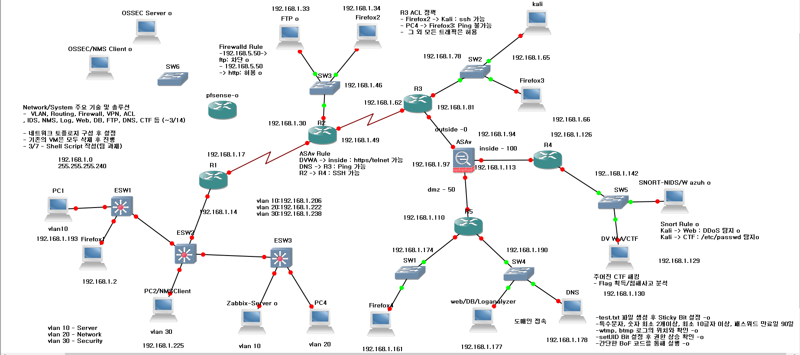

# 🔐 네트워크 & 리눅스 기반 보안 실습 환경 구성도

> 이 문서는 실제 보안 실습을 위해 구성한 네트워크와 리눅스 시스템 아키텍처를 시각적으로 표현하고,  
> 각 구성 요소에 대한 설명을 통해 실습 범위와 역량을 정리한 것입니다.

---

## 🗺️ 전체 토폴로지 구성도

---

## 🧱 주요 Linux 시스템 설명

| 시스템 역할 | OS 버전 | 주요 기능 및 용도 |
|-------------|---------|------------------|
| **Kali** | Kali Linux | 공격자 역할, CTF 공격 시나리오 수행, SQLi/Reverse Shell 등 실습 |
| **DVWA/CTF 서버** | Rocky Linux | DVWA 기반 공격 대상, Flag 수집 및 취약점 실습 대상 |
| **LogAnalyzer/웹 서버** | Rocky Linux | Suricata, OSSEC 로그 수집 및 분석 웹 서버 |
| **FTP 서버** | Rocky Linux | 취약한 설정이 있는 FTP 서버, 파일 업로드 실습 |
| **Zabbix 서버** | Rocky Linux | 모니터링 서버, 에이전트 정보 수집 |
| **DNS 서버** | Rocky Linux | 내부 도메인 설정 및 테스트 용도 |
| **OSSEC 서버/에이전트** | Rocky Linux | HIDS 탐지용. 서버-클라이언트 구조로 로그 무결성 실습 |
| **pfSense** | pfSense | VPN 및 방화벽 실습. OpenVPN 터널링 테스트 |
| **Snort 서버** | Rocky Linux | ICMP, DDoS, /etc/passwd 접근 탐지 등 시그니처 기반 NIDS |

---

## 🔍 실습 포인트

- `Suricata`, `Snort`, `OSSEC` 탐지 시나리오 작성
- `BoF`, `SetUID`, `Sticky Bit`, `passwd 정책` 테스트
- `pfSense`를 통한 원격 접근 제어 및 VPN 설정
- `GoAccess` 및 `LogAnalyzer`로 웹 로그 시각화

---

## 📁 다음 구성 예정

- [ ] 각 시스템 별 구성 스크린샷 폴더
- [ ] Suricata 룰 모음
- [ ] 공격 시나리오 PDF 정리본
